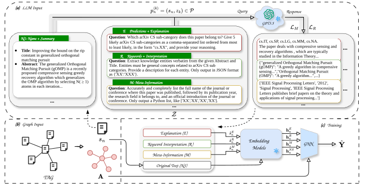

# Rethinking Graph-LLMs: Are Performance Gains Confounded by Data Leakage?

**CIKM 2026** · Proceedings of the 35th ACM International Conference on Information and Knowledge Management

**Yangchun Ye, Qin Tian, Xuan Guo, Wenjun Wang, Qiyao Peng, Tianpeng Li**



## 1. Environments

**`DataLeakage`** (GNN, Python 3.8)

```bash
conda create --name DataLeakage python=3.8 -y
conda activate DataLeakage
conda install pytorch==1.12.1 torchvision==0.13.1 torchaudio==0.12.1 cudatoolkit=11.3 -c pytorch
conda install -c pyg pytorch-sparse pytorch-scatter pytorch-cluster pyg
pip install ogb
conda install -c dglteam/label/cu113 dgl
pip install yacs transformers
pip install --upgrade accelerate
```

**`gen_emb`** (embeddings, Python 3.9, `transformers>=4.51.0`)

```bash
conda create -n gen_emb python=3.9 -y
conda activate gen_emb
pip install torch==2.8.0
pip install transformers==4.51.0
pip install scikit-learn==1.6.1
pip install accelerate==1.10.1
pip install torch-geometric==2.6.1

# Additional Dependencies
pip install numpy==2.0.2
pip install scipy==1.13.1
pip install tqdm==4.67.1
pip install PyYAML==6.0.3
```

## 2. Dataset

[OSF](https://osf.io/8xrus/files/osfstorage?view_only=abaa64ccbd6c45eaa34166d9f7f0d95a) provides access to the *.pt files. Download the dataset [here](https://files.osf.io/v1/resources/8xrus/providers/osfstorage/?view_only=abaa64ccbd6c45eaa34166d9f7f0d95a&zip=), unzip and move it to `processed_data`.

## 3. Training

### LM

One run per embedding model (E5 or Qwen). Output: `prt_lm/{dataset}/{model}_{feature}-seed{seed}.emb`.

| Model | CLI |
|-------|-----|
| E5 | `--model e5` |
| Qwen | `--model qwen` |

```bash
conda activate gen_emb
python -m gen_emb.generate --dataset cora --text_types NS E R M RM --model e5 --seed 0 --device 0
```

| Feature | Meaning |
|---------|---------|
| `NS` | Original text |
| `E` | Prediction + explanation |
| `R` | Keyword + Interpretation |
| `M` | Meta-Information |

### GNN

One run per feature type or combination (`_` joins types; ensemble averages logits). Backbones: `MLP`, `GCN`, `SAGE`, `RevGAT`.

```bash
conda activate DataLeakage
python -m core.trainEnsemble dataset cora gnn.train.feature_type NS_E gnn.model.name GCN lm.model.name intfloat/multilingual-e5-large
```

### Total

End-to-end via `run_*.sh` (embedding → GNN, logs in `out_{dataset}/`).

```bash
./run_citation.sh
./run_person.sh
```

## Citation

If you find this work useful, please cite:

```bibtex
@inproceedings{ye2026rethinking,
  title     = {Rethinking Graph-LLMs: Are Performance Gains Confounded by Data Leakage?},
  author    = {Ye, Yangchun and Tian, Qin and Guo, Xuan and Wang, Wenjun and Peng, Qiyao and Li, Tianpeng},
  booktitle = {CIKM 2026},
  year      = {2026}
}
```
